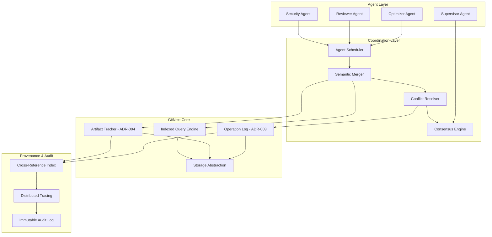
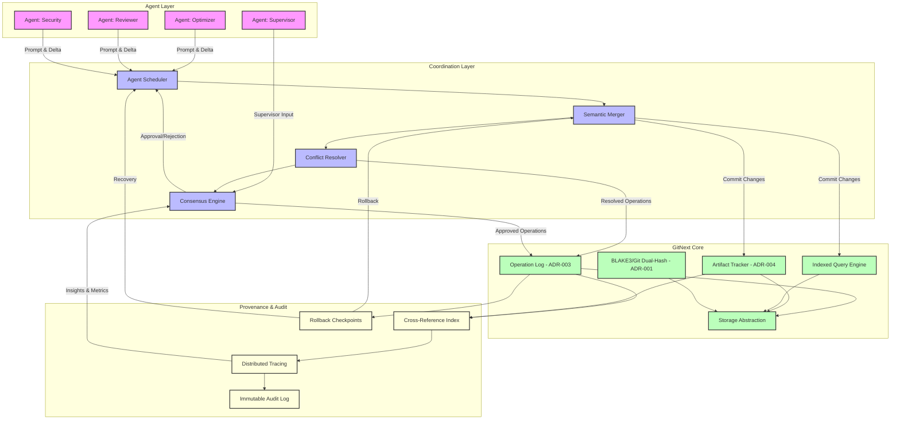

# GitPMS

> Git-native Prompt Management System (PMS)


---

## 1. Overview

GitPMS is a multi-agent execution framework and a Prompt Management System (PMS) built on [**GitNext**](https://github.com/yumin-chen/git-next), designed to provide deterministic, auditable, and reproducible execution of prompt-based workflows. It leverages GitNext primitives—operation log, artifact tracking, and dual-hash identity system—to coordinate multiple agents while ensuring semantic conflict resolution, provenance tracking, and rollback capabilities.

Git-PMS provides a **robust, auditable, deterministic multi-agent execution framework** leveraging GitNext primitives. It solves prior scalability, conflict, consensus, and observability gaps. With cryptographically-secure agent namespaces, artifact-based semantic conflict detection, and indexed provenance, it is production-ready and fully compatible with Git workflows.


## 2. Goals

1. **Deterministic multi-agent execution** with causality guarantees
2. **Semantic conflict detection** across artifacts and resources
3. **Provenance tracking** for agent actions and prompt outputs
4. **Reputation-weighted consensus** for merges and approvals
5. **Safe rollback and checkpointing** for operational safety
6. **Full auditability** via immutable operation log and tracing
7. **Cross-platform and multi-environment support** (CLI, WASM, cloud)

---

## 3. Glossary

| Term                 | Definition                                                                                                                |
| -------------------- | ------------------------------------------------------------------------------------------------------------------------- |
| **GitNext_System**   | The underlying GitNext platform providing storage, operation log, artifact tracking, and indices.                         |
| **AgentOperation**   | A GitNext operation entry extended with agent metadata, prompt hash, confidence, and causal dependencies.                 |
| **SemanticResource** | Logical code/configuration/database resources tracked as artifacts.                                                       |
| **ArtifactTracker**  | GitNext module managing stable artifact identities and provenance.                                                        |
| **AgentNamespace**   | BLAKE3-based internal agent storage with capability-based access control.                                                 |
| **QuorumPolicy**     | Defines weighted voting and approval rules for multi-agent consensus.                                                     |
| **DeterminismTier**  | Classification of operations: Green (fully deterministic), Yellow (conditionally deterministic), Red (non-deterministic). |
| **Checkpoint**       | Snapshot of repository state for rollback purposes.                                                                       |

---

## 4. Mapping to GitNext ADRs

| Git-PMS Feature                    | GitNext ADR | Mapping / Rationale                                                                                      |
| ---------------------------------- | ----------- | -------------------------------------------------------------------------------------------------------- |
| Operation log for causality        | ADR-003     | Agent operations stored as log entries; enables undo/redo, deterministic replay, and causality tracking. |
| Artifact-based semantic resources  | ADR-004     | Semantic conflict detection via artifact dependency graphs; orthogonal to Git compatibility.             |
| Dual-hash agent isolation          | ADR-001     | Internal BLAKE3 identity for agent objects; SHA-1 only at Git export boundaries.                         |
| Indexed provenance queries         | ADR-004     | Reuses GitNext indices for efficient O(log N) queries of operations and artifacts.                       |
| Rollback and checkpointing         | ADR-003     | Checkpoints leverage operation log positions for deterministic rollback.                                 |
| Cross-agent capability enforcement | ADR-002     | Uses GitNext storage abstraction with cryptographic tokens for secure delegation.                        |

---

## 5. Architecture

### 5.1 Layered Architecture



**Prompt flow, artifact tracking, commits, semantic conflict resolution, consensus, and rollback**:



1. **Prompt-to-Commit Flow**: Agent prompts are scheduled → merged → resolved → applied to GitNext
2. **Semantic Conflict Resolution**: Artifact tracker and conflict resolver ensure overlapping logical changes are detected
3. **Consensus Engine**: Role-based quorum, veto, and reputation-weighted voting integrated
4. **Operation Log & Checkpoints**: Deterministic undo/redo and rollback points
5. **Provenance & Audit**: Cross-references, distributed tracing, and immutable audit log
6. **Dual-Hash Isolation**: Agent boundaries maintained with BLAKE3 internally, SHA-1 externally

---


---

## 6. Component Descriptions

### 6.1 Agent Layer

* Each agent (Optimizer, Reviewer, Security, Supervisor) operates in its **AgentNamespace**.
* BLAKE3 hashes used internally; SHA-1 only for Git export.
* Agents issue operations stored in GitNext's operation log.

### 6.2 Coordination Layer

* **Agent Scheduler**: Determines execution order and assigns tasks.
* **Semantic Merger**: Integrates multiple agent outputs.
* **Conflict Resolver**: Detects semantic conflicts using artifact dependency graphs.
* **Consensus Engine**: Applies quorum policies with reputation-weighted voting.

### 6.3 GitNext Core

* **Operation Log**: Tracks all agent operations for determinism and rollback.
* **Artifact Tracker**: Maintains artifact identities and dependencies.
* **Indexed Query Engine**: Supports fast provenance queries and history lookup.
* **Storage Abstraction**: Supports multiple backends (Memory, SQLite, PostgreSQL, S3, IndexedDB).

### 6.4 Provenance & Audit

* **Cross-Reference Index**: Maps operations to artifacts and prompts.
* **Distributed Tracing**: Captures causal spans of agent actions.
* **Immutable Audit Log**: Provides full traceability and security auditing.

---

## 7. Multi-Agent Execution Semantics

1. **AgentOperation**

   ```rust
   struct AgentOperation {
       git_operation: LogEntry,  // ADR-003
       agent_id: AgentId,
       prompt_hash: Blake3Hash,
       confidence: f64,
       causal_dependencies: Vec<OperationId>,
   }
   ```
2. **Semantic Resources**

   * Tracked as artifacts: code functions, configurations, database schema.
   * Conflict detection via **dependency overlap**.
3. **Consensus**

   * Weighted voting with quorum rules, veto roles, tie-breakers.
   * Reputation tracking based on historical operation outcomes.
4. **Rollback**

   * Checkpoints saved using operation log positions.
   * Emergency rollback restores repository deterministically.

---

## 8. Security and Authorization

* **AgentNamespaces** enforce access policies.
* **SignedCapabilities** allow controlled cross-agent reads/writes.
* **Reputation-weighted consensus** prevents malicious or Byzantine agents.
* **Audit logs** capture all operations and vote decisions for external verification.

---

## 9. Determinism

* Operations classified into **Green/Yellow/Red tiers**.
* Replay via operation log validates determinism.
* Snapshots for external data (RAG, API) ensure reproducibility.
* Tree diffs confirm state equivalence post-replay.

---

## 10. Observability

* Distributed tracing captures agent operations and causal relationships.
* Causality graph renders execution DAG.
* Anomaly detection flags unusual behavior (token spikes, long spans).

---

## 11. Correctness Properties

* **Causality**: GitNext operation log ensures deterministic ordering.
* **Semantic Merge**: Artifact-based dependency checks prevent logical conflicts.
* **Consensus**: Weighted quorum ensures valid decision-making.
* **Rollback**: Checkpoint/undo mechanism guarantees state recovery.
* **Provenance**: Indexed queries confirm prompt→artifact→commit lineage.
* **Determinism**: Replay validates outputs match expected results.

---

## 12. Deployment Considerations

* **Storage Backends**: Memory for tests, SQLite/PostgreSQL for local/distributed, IndexedDB for browser, S3 for cloud.
* **Scalability**: Indexed queries and operation log support O(log N) lookups.
* **Cross-Platform**: CLI, WASM, cloud-native, and embedded environments supported.
* **Performance**: Parallel execution of independent agents; batch commits for high-frequency operations.

---

## 13. Non-Goals

* SSH transport in initial version
* Hook execution
* Automatic reconciliation of Red-tier non-deterministic operations
* Real-time GUI; CLI/WASM interfaces only

---

## 14. References

* GitNext ADRs: ADR-001, ADR-002, ADR-003, ADR-004
* Git-PMS internal design review, 2025-12-30
* Rust async/await ecosystem
* WebAssembly bindings for GitNext

---
